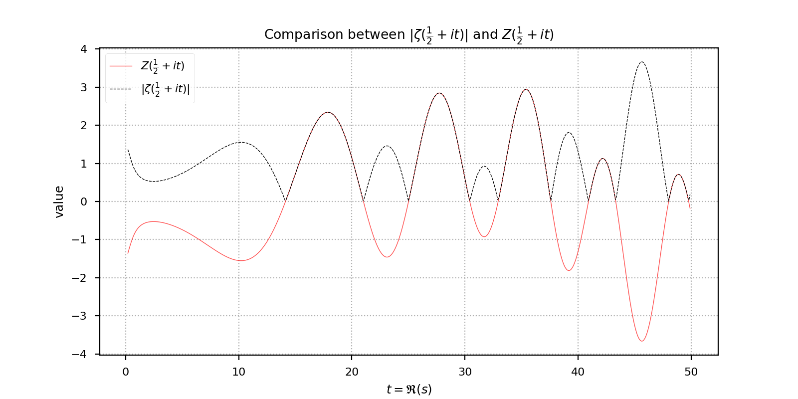
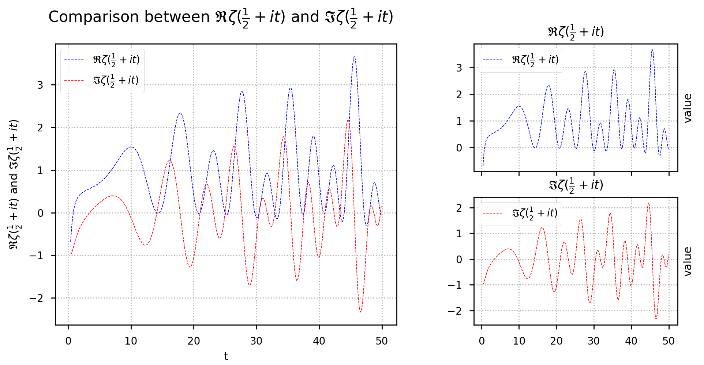

# 基于python的Riemann猜想验证及 $\zeta$ 函数的零点计算

USTC 数学科学学院 杨萱泽

## 1 科学技术原理

### 1.1 Riemann猜想简介

&emsp;&emsp;黎曼猜想是德国数学家伯恩哈德·黎曼（Riemann）于1859年提出。它是数学中一个重要而又著名的未 解决的问题，有“猜想界皇冠”之称，多年来它吸引了许多出色的数学家为之绞尽脑汁。黎曼猜想的具体表述形式如下：
> Riemann猜想(Riemann Hypothesis, RH)：函数
$$\zeta(s)=\sum_{n=1}^\infty \frac{1}{n^s} \tag{1}$$
在解析延拓到  $\mathbb{C}\setminus\{1\}$ 后，其全部非平凡零点都位于直线 $\mathfrak{R}s=\frac{1}{2}$上。

其中 $\zeta(s)$ 称为Riemann $\zeta$函数，它的平凡零点是全体负偶数（ $-2, -4, \dots$ ）除此之外的零点称为非平凡零点。直线 $\mathfrak{R}s=\frac{1}{2}$ 也被称为特征线(critical line)；区域 ${z: 0<\mathfrak{R}z<1 }$ 被称为特征带(critical strip)。

&emsp;&emsp;黎曼猜想之所以被认为是当代数学中一个重要的问题，主要是因为很多深入和重要的数学和物理结果都能在它成立的大前提下得到证明。大部分数学家也相信黎曼猜想的正确性。克雷数学研究所设立了1,000,000美元的奖金给予第一个得出正确证明的人。[^1]

### 1.2 数值方法验证Riemann猜想

&emsp;&emsp;尽管自从黎曼猜想至今仍未被证明，但是许多数值模拟验证了该猜想在大规模计算下的准确性。其中较为著名的有：[^2]

- 1966年，R.S.Lehman验证了前250,000个非平凡零点在特征线上；
- 1968年，T.B.Rosser, J.M.Yohe, L.Schoenfeld验证了前3,502,500个非平凡零点均在特征线上；
- 1982年，R.P.Brent, J.van de Lune, H.J.J te Riele, D.T.Winter验证了前200,000,001个非平凡零点在特征线上；
- 2004年，Xavier Gourdon验证了前10,000,000,000,000个非平凡零点在特征线上；

&emsp;&emsp;本项目基于python语言，验证了 $\zeta$ 函数在 $\mathfrak{I}s\leq 1000$ 内的非平凡零点(共计649个)均位于特征线上，并计算了前500个非平凡零点的近似值（精确到 $10^{-4}$ ）。其中用到的数学原理如下：

#### 1.2.1 交错级数收敛方法

&emsp;&emsp;由于 $\zeta$ 函数的原始定义域中并不包含特征带，我们不能直接使用定义中的级数进行计算。由交错级数的收敛理论，我们有如下的命题：[^3]

> Proposition: 令 $$e_k=\sum_{j=k}^n\binom{n}{j}$$ 则有： $$\zeta(s)=\frac{1}{1-2^{1-s}} \bigg ( \sum_{k=1}^n\frac{(-1)^{k-1}}{k^s} +\frac{1}{2^n}\sum_{k=n+1}^{2n}\frac{(-1)^{k-1}e_{k-n}}{k^s}\bigg )+\gamma_n(s) \tag{2}$$ 其中对于复变量 $s=\sigma+it$， $\sigma>0$ ，有如下的误差项估计： $$\left\lvert \gamma_n(s) \right\rvert \leq \frac{1}{8^n}\frac{(1+\left\lvert t/\sigma \right\rvert)e^{\left\lvert t \right\rvert \pi /2}}{\left\lvert 1-2^{1-s} \right\rvert} \tag{3}$$

&emsp;&emsp;由上述命题，即可通过交错级数来逼近 $\zeta$ 函数在特征线上的值，并且误差项 $\gamma_n(s)$ 能够得到很好的控制。理论上，只要 $n$ 取得足够大，误差项可以被控制到任意指定的小量。

&emsp;&emsp;由(3)可以得知，在给定误差要求的前提下，利用公式(2)需要累加的项数为 $O(\left\lvert t \right\rvert)$ 。

#### 1.2.2 Riemann-Siegel 公式

&emsp;&emsp;除了1.2.1中给出的交错级数求和以外，还可以用Riemann-Siegel公式进行计算。

> Riemann-Siegel公式：设 $x, y\in \mathbb{R}^+$ ，满足 $2\pi xy=\left\lvert t  \right\rvert$ . 则对于 $s=\sigma+it, 0 \leq \sigma \leq 1$ ，有： $$\zeta(s)=\sum_{n\leq x}\frac{1}{n^s}+\chi(s)\sum_{n\leq y}\frac{1}{n^{1-s}}+O(x^{-\sigma})+O({\left\lvert t \right\rvert}^{1/2-\sigma}y^{\sigma-1}) \tag{4}$$ 
> 其中 $$\chi(s)=2^s\pi^{s-1}\sin(\frac{\pi s}{2})\Gamma(1-s)$$ .

&emsp;&emsp;特别地，在(4)中取 $x=y=\sqrt{\left\lvert t \right\rvert /(2\pi)}$ ，则有 $$\zeta(s)=\sum_{n\leq x}\frac{1}{n^s}+\chi(s)\sum_{n\leq y}\frac{1}{n^{1-s}}+E_m(s), m=\bigg\lfloor\Big(\frac{\left\lvert t \right\rvert}{2\pi}\Big)^{1/2}\bigg\rfloor \tag{5}$$ 
其中， $$E_m(s)=O({\left\lvert t \right\rvert}^{-\sigma/2})$$ .

&emsp;&emsp;对于 $s=\sigma+it$ 的情形，我们定义 $$\theta(t)=\arg\Big(\pi^{-it/2}\Gamma(\frac{1}{4}+i\frac{t}{2}\Big )) \tag{6}$$ 有 $$e^{i\theta(t)}=\chi(\frac{1}{2}+it)^{-1/2}$$ 

与此同时，由Taylor公式，可以得到 $\theta(t)$ 的渐进公式： $$\theta(t)=\frac{t}{2}\log{\frac{t}{2\pi}}-\frac{t}{2}-\frac{\pi}{8}+\frac{1}{48t}+\frac{7}{5760t^3}+\dots \tag{7}$$ 

&emsp;&emsp;我们再定义Riemann-Siegel Z-函数(也成为Hardy Z-函数)： $$Z(t)=e^{i\theta(t)}\zeta(\frac{1}{2}+it) \tag{8}$$ 可以证明， $Z(t)$ 是实数到实数的映射，从而是实函数。并且 $Z(t)$ **和** $\zeta(\frac{1}{2}+it)$ **有着相同的零点**。

&emsp;&emsp;结合(5)(6)(7)，我们可以得到 $$Z(t)=2\sum_{n=1}^m\frac{\cos(\theta(t)-t\log{n})}{\sqrt{n}}+(-1)^{m+1}\tau^{-1/2}\sum_{j=0}^M(-1)^j\tau^{-j}\Phi_j(z)+R_M(t) \tag{9}$$ 其中 $$R_M=O(t^{-(2M+3)/4}),\ \tau=\sqrt{\frac{t}{2\pi}}, \  m=\lfloor \tau\rfloor,\ z=2(\tau-m)-1 \tag{10}$$ 

余项中的函数 $$\Phi_0(z)=\frac{\cos(\frac{1}{2}\pi z^2+\frac{3}{8}\pi)}{\cos(\pi z)} \tag{11}$$ $$\Phi_1(z)=\frac{1}{12\pi^2}\Phi_0^{(3)}(z) \tag{12}$$   $$\dots\ \dots$$ 

对于(8)中的误差项 $R_M(t)$ ，当 $t\geq 200$ 时，有如下的估计：[^3]  $$\left\lvert R_0(t) \right\rvert \leq 0.127t^{-3/4},\ \left\lvert R_1(t) \right\rvert \leq 0.053t^{-5/4}$$ 由此可加，在 $t$ 不太小的情况下，只需要取 $M=1$ 即可有效地控制误差。

#### 1.2.3 Backlund 零点计数定理

&emsp;&emsp;对于有界特征带 $C_T={z: 0<\mathfrak{R}z<1\quad 0<\mathfrak{I}z<T }$ ， $\zeta$ 函数在其中的零点个数有如下的刻画：[^4]
> Backlund零点计数定理：用 $N(T)$ 表示 $\zeta$ 函数在 $C_T$ 上的零点个数，假设 $\zeta(s)$ 在线段 ${ \sigma+iT : 0 \leq \sigma \leq 1 }$ 上没有零点，则有 $N(T)=$ 和 $\frac{\theta(T)}{\pi}+1 \tag{13}$最接近的自然数。

从而，只需要计算出(6)中定义的 $\theta(T)$ ，即可得出在 $C_T$ 上的零点总数。

#### 1.2.4 介值定理

&emsp;&emsp;对于实值函数，我们有如下的定理：
> 介值定理：设 $f$ 是 $\mathbb{R}$ 上的实值连续函数，如果 $$\exist a < b,\ s.t.\ f(a)\cdot f(b) < 0$ $则 $f$ 在区间 $(a, b)$ 上必有零点。

## 2 设计方案

### 2.1 主要步骤的陈述

&emsp;&emsp;有了上述结论，我们可以采用如下思路来数值验证Riemann猜想：

- 步骤1: 对于给定的 $T$ ，将特征带限制为有界特征带 $C_T$ ，验证 $\zeta$ 函数在有界特征带上的非平凡零点都在特征线上；
- 步骤2：由(13)，计算出 $\zeta(s)$ 在 $C_T$ 上的零点总数 $N(T)$ ；
- 步骤3：计算 $\zeta(s)$ 在 $C_T$ 中的特征线上的零点个数，也即关于 $t$ 的函数 $\zeta(\frac{1}{2}+it)$ 在 $0<t<T$ 上的零点个数，记作 $M(T)$ ；
- 步骤4：比较 $N(T)$ 与 $M(T)$ 是否相等，若相等，则在 $C_T$ 上验证了Riemann猜想；

&emsp;&emsp;需要补充说明的是，在步骤2中，我们注意到 $\zeta(\frac{1}{2}+it)$ 和 $Z(t)$ 有相同的零点，从而只需要计算 $Z(t)$ 的零点个数；而 $Z(t)$ 是连续的实函数，可以用介值定理来“探测”其零点。

### 2.2 主要步骤的python实现

&emsp;&emsp;本项目的程序主要由3个模块组成：
- check_RH.py: 用交错级数和Riemann-Siegel公式两种方法求出在特征线上的 $\zeta(s)$ ；用Backlund的计数定理求出 $C_T$ 上的零点总数；对实函数 $Z(t)$ ，通过介值定理得到其在 $C_T$ 上的零点总数，与 $N(T)$ 比较，从而验证Riemann猜想；
- compute_zero.py：对check_RH.py中找到零点的区间进一步细分，用二分法求出此区间上的零点的数值（精确到 $10^{-5}$ ）；
- drawing.py：绘制 $\zeta(\frac{1}{2}+it)$ 、 $Z(t)$ 、 $\left\lvert \zeta(\frac{1}{2}+it) \right\rvert$ 的图像，直观地理解Riemann猜想；

#### 2.2.1 check_RH.py

定义的常量：

- PI：圆周率 $\pi$ 
- ERROR：用交错级数方法求 $\zeta$ 函数值时，误差项(3)的上界
- CHANGE_METHOD：改变计算方法的分界点，在此之前用交错级数法求和，在此之后用Riemann-Siegel公式求和
- FILE_NAME：保存计算得到的零点存在区间的文件路径

实现的函数（只列出主要的函数）：

- compute_zeta_AS(t) 
  函数功能：根据式(2)，用交错级数法求出 $\zeta(\frac{1}{2}+it)$ 的值，其绝对误差不超过ERROR
  参数说明：t-自变量s的虚部，float类型
  返回值： $\zeta(\frac{1}{2}+it)$ 的计算值，complex类型
  实现方法：根据误差项要求，求出循环次数；定义enum(k)函数，计算组合数求和 $e_k$ 的值；通过while循环，求出 $\zeta(\frac{1}{2}+it)$ 满足精度要求的近似值
- compute_Zeta_AS(t)
  函数功能：用交错级数方法求出 $Z(t)$ 的近似值
  参数说明：t-自变量s的虚部，float类型
  返回值： $Z(t)$ 的计算值，float类型
  实现方法：根据定义式(8)和 $\theta(t)$ 的渐进展开式(7)，由compute_zeta_AS的计算结果，得出 $Z(t)$ 的值
- compute_Zeta_RS(t)
  函数功能：通过Riemann-Siegel公式的推论(9)，近似计算 $Z(t)$ 的函数值
  参数说明：t-自变量s的虚部，float类型
  返回值： $Z(t)$ 的计算值，float类型
  实现方法：通过sympy库中的diff方法，实现对式(11)(12)余项中的函数的计算；通过while循环，完成主要部分的累加；其中式(10)中 $M$ 取1，则误差项满足 $\left\lvert R_1(t) \right\rvert \leq 0.053t^{-5/4}$ 
- compute_zeta_RS(t)
  函数功能：借助Riemann-Siegel公式，计算 $\zeta(\frac{1}{2}+it)$ 的值
  参数说明：t-自变量s的虚部，float类型
  返回值： $\zeta(\frac{1}{2}+it)$ 的计算值，complex类型
  实现方法：与compute_Zeta_AS类似，通过定义式和compute_Zeta_RS求出 $\zeta(\frac{1}{2}+it)$ 的值
- zeros_number(T)
  函数功能：求出 $\zeta(s)$ 在 $C_T$ 中的零点个数 $N(T)$ 
  参数说明：T-考察的有界特征带的上界，float类型
  返回值： $N(T)$ 的值，int类型
  实现方法：见式(13)
- check_RH(T, delta)
  函数功能：在有界特征带$C_T$上验证Riemann猜想，并将找到的零点存在区间和程序运行时间写入文件中
  参数说明：T-有界特征带的上界，float类型；delta-对 $Z(t)$ 的采样的步长，float类型
  返回值：True若Riemann猜想验证成功；否则返回False
  实现方法：对$\Zeta(t)$进行以delta为步长的采样，若发现在某个t和t+delta处，$Z(t)$ 出现变号，也即 $Z(t)\cdot \Zeta(t+delta) < 0$ ，则可以判断在这个区间内存在零点，count_zeros加1，并将此区间和零点编号写入文件中；完成上述过程后，将运行时间也写入文件中，同时得出找到的零点个数count_zeros，将它与预期的零点个数zeros_number(T)对比，如果相等，则成功验证Riemann猜想，返回True；否则返回False.

#### 2.2.2 compute_zeta.py

定义的常量：

- ACCURACY：计算 $\zeta(\frac{1}{2}+it)$ 的零点的精度

实现的函数：

- compute_zero(low, high, method, accuracy=ACCURACY)
  函数功能：在零点存在区间 $(low, high)$ 中精确计算零点的值
  参数说明：low-零点存在区间的下界，float类型；high-零点存在区间的上界，float类型；method-根据t的取值，选用不同的计算方法，function类型；accuracy-计算的精确度，float类型
  返回值：零点的精确计算值，float类型
  实现方法：对 $Z(t)$ 在存在区间 $(low, high)$ 上进行二分
- compute_from_file(filename, compute_num)
  函数功能：读取文件中的零点存在区间，并用compute_zero函数计算每个存在区间上零点的精确值，并写入文件中
  参数说明：filename-读取存在区间的文件名，str类型；compute_num-要计算的零点个数，int类型
  返回值：无
  实现方法：从文件filename中提取存在区间，调用compute_zero计算其中的零点，并写入文件中；最后将运行时间也写入文件中

#### 2.2.3 drawing.py

实现的函数：

- draw_zeta_critical_line(begin, end, step=0.1)
  函数功能：绘制 $\zeta(\frac{1}{2}+it)$ 随着$t$的变化的动态函数图像(gif格式)，其中x坐标表示 $\zeta(\frac{1}{2}+it)$ 的实部，y坐标表示其虚部
  参数说明：begin-参数t的最小值，float类型（出于精度要求，begin不能小于0.4）；end-参数t的最大值，float类型；step-采样的步长，float类型，默认值为0.1
  返回值：无
  实现方法：调用check_RH.py中定义的compute_zeta_AS函数，计算 $\zeta(\frac{1}{2}+it)$ 的值，从而得到实部和虚部；调用了matplotlib.animation库中的FuncAnimation模块，用于绘制并保存gif格式的动态函数图像
- compare(begin, end, step=0.1)
  函数功能：在同一个坐标系下绘制 $\left\lvert \zeta(\frac{1}{2}+it) \right\rvert$ 和 $\Zeta(t)$ 的函数图像，验证关系式 $\left\lvert \zeta(\frac{1}{2}+it) \right\rvert=\left\lvert \Zeta(t) \right\rvert$ 
  参数说明：begin-参数t的最小值，float类型（出于精度要求，begin不能小于0.2）；end-参数t的最大值，float类型；step-采样的步长，float类型，默认值为0.1
  返回值：无
  实现方法：调用check_RH.py中定义的compute_Zeta_AS和compute_zeta_AS函数，用于计算 $\zeta(\frac{1}{2}+it)$和$\Zeta(t)$ 的函数值；调用了matplotlib库中的绘图模块
- zeta_critical_line_real_imag(begin, end, step=0.1)
  函数功能：绘制 $\zeta(\frac{1}{2}+it)$ 的实部、虚部的图像，并加以对比
  参数说明：begin-参数t的最小值，float类型（出于精度要求，begin不能小于0.4）；end-参数t的最大值，float类型；step-采样的步长，float类型，默认值为0.1
  返回值：无
  实现方法：调用check_RH.py中定义的compute_zeta_AS函数，

## 3 创新性描述

分析用交错级数方法和Riemann-Siegel方法逼近 $\zeta(s)$ 或 $Z(t)$ 的时间复杂度，可以得知：在给定误差上界的情况下，式(2)中累加的项数为 $O(\left\lvert t \right\rvert)$ ，而式(9)中累加的项数为 $O(\sqrt{\left\lvert t \right\rvert})$ 。从而在$T$较大时，使用Riemann-Siegel方法的计算效率会明显高于交错级数方法。

另一方面，使用式(2)计算时，误差项 $\gamma_n(s)$ 可以任意小，而式(9)中累加次数 $m$ 是由 $t$ 确定的，只有在 $\left\lvert t \right\rvert$ 较大时，才能通过误差项公式 $\left\lvert R_0(t) \right\rvert \leq 0.127t^{-3/4},\ \left\lvert R_1(t) \right\rvert \leq 0.053t^{-5/4}$ 有效地控制误差，因此从计算精度考虑，交错级数方法的计算误差能被更好地控制。

综合来看，$\left\lvert t \right\rvert$ 较小时，我们使用交错级数方法，此时累加次数虽然是 $O(\left\lvert t \right\rvert)$ ，但是由于 $\left\lvert t \right\rvert$ 不太大，所需要地绝对时间仍然可以接受； $\left\lvert t \right\rvert$ 较大时，我们使用Riemann-Siegel公式，此时由于 $\left\lvert t \right\rvert$ 较大，误差项能被控制在可以接受的范围内，并且此时的计算效率也相对较高。

具体而言，我们选定两种计算方法的分界点为CHANGE_METHOD=200，此时用Riemann-Siegel方法的计算误差项满足 $$\left\lvert R_1(t) \right\rvert \leq 0.053t^{-5/4}\leq 7\times 10^{-5}$$ 足够我们的要求。

其次，本项目也从不同角度对 $\zeta$ 函数进行了可视化，包括 $\zeta$ 函数的实部、虚部在特征线上的动态变化图像，$\zeta$ 函数的模长和Riemann-Siegel-$Z$ 函数的对比图像， $\zeta$ 函数在特征线上的实部、虚部分别的图像（具体见第4.3）。

## 4 运行方法和参数设置

### 4.1 check_RH.py 运行方法

在程序的最后输入语句：

> check_RH(1000, 0.1)

运行即可。

*注意：参数delta不能设置得过大，否则在采样时可能会漏掉零点；也不能设置得过小，否则运行时间会很长。*

此程序会在当前目录生成一个名为"zeros_records.txt"的文本文件，其中每行存储了零点的编号、存在区间，例如

> Zero No.1:	(14.1, 14.2)
Zero No.2:	(21.0, 21.1)
Zero No.3:	(25.0, 25.1)

在此文本文件的最后存储了找到的零点个数和通过Backlund定理算出的零点个数，例如

> Expecting 649.0 zeros.
Find 649 zeros.

比较上面的Expecting 649.0 zeros和Find 649 zeros，可以得知，在 $C_{1000}$ 上Riemann猜想成功验证。

以及程序运行所用时间：

> Total time cost: 280.6123475 seconds.
Average time cost: 0.4323765 seconds per zero.

由于此程序运行时间较长，我们加入了进度条，从而可以直观地观测到程序的运行进度。

### 4.2 compute_zero.py 运行方法

在程序的最后输入语句

> compute_from_file(FILE_NAME, 500)

运行即可。

此程序会从文件FILE_NAME中读取零点的存在区间，并计算零点的精确值（精确到 $10^{-5}$ ），并在当前目录生成一个名为"compute_zeros.txt"的文本文件，其中存储了计算得出的前500个零点的数值，例如

> Zero No 1:	14.13473
Zero No 2:	21.02204
Zero No 3:	25.01086

在文件的最后存储了计算的精度和运行时间，例如

> With accuracy: 1e-05
Total time cost:	962.0139017 seconds.
Average time cost:	1.9240278034 seconds per zero.

可以通过修改全局变量ACCURACY的值来调节计算精度（默认为1e-5）。

为了检验零点计算的准确性，我们可以将文件compute_zeros.txt中的计算结果和LMFDB(The L-functions and modular forms database)中的 [ $\zeta$ 函数零点表](https://www.lmfdb.org/zeros/zeta/) 对比，可见计算结果的小数点后前4位均为准确值。

### 4.3 drawing.py 运行方法

在程序的最后输入语句

> draw_zeta_critical_line(1, 50)

并运行，可以得到在参数 $1<t<50$ 的 $\zeta(\frac{1}{2}+it)$ 的动态图像，并以"dynamical_zeta.gif"为名保存在当前目录下。

在程序的最后输入语句

> compare(0.2, 50)

运行，可以得到在参数区间 $0.2<t<50$ 的 $\left\lvert \zeta(\frac{1}{2}+it) \right\rvert$ 与 $Z(t)$ 的函数图像，如下

在程序的最后输入语句

> zeta_critical_line_real_imag(0.4, 50)

运行，可以得到参数区间 $0.4<t<50$ 上的 $\zeta(\frac{1}{2}+it)$ 的实部和虚部的图像，如下

## 5 学习心得和收获

(1) 较为全面地学习了python这门语言，通过库函数的调用，初步体会到了python语言的方便、快捷；同时在实践中也意识到了python语言与C、C++相比，运行效率较低的缺点；

(2)帮助自己培养了计算思维，在遇到相关的实际问题时能想到借助编程语言来辅助解决；

(3)在查阅文献的过程中，通过对比多个来源的文献，发现了一篇文献(文献3)中的的一处笔误（这处笔误对整个算法有极大的影响，会对Riemann-Siegel方法的计算精度产生3~4个数量级的偏差）。

### 参考资料

[^1]:https://zh.wikipedia.org/wiki/%E9%BB%8E%E6%9B%BC%E7%8C%9C%E6%83%B3
[^2]:Xavier. “The 10 13 first zeros of the Riemann Zeta function , and zeros computation at very large height.” (2004).
[^3]:Gourdon, Xavier and Pascal Sebah. “Numerical evaluation of the Riemann Zeta-function.” (2003).
[^4]:Pugh, Glendon Ralph. “The Riemann-Siegel formula and large scale computations of the Riemann zeta function.” (1998).
